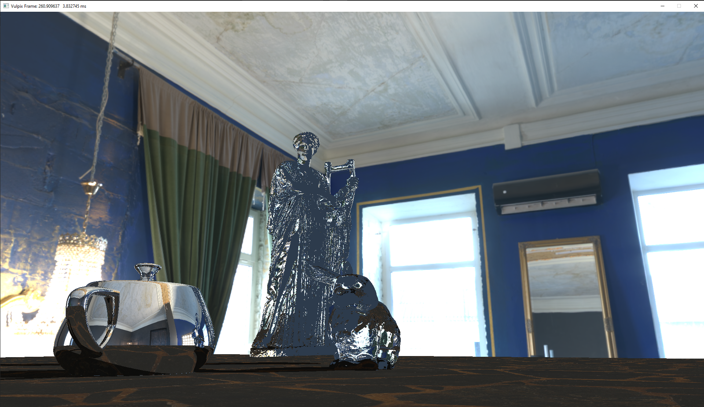

# Vulpix - Vulkan based Ray Tracer

Vulpix is a real-time ray tracing renderer built using the Vulkan API. 
Inspired by the captivating [Fire-type Pokemon](https://www.pokemon.com/us/pokedex/vulpix) of the same name. Vulpix combines the power of Vulkan and the art of ray tracing to bring you stunningly lifelike graphics. 


**Note: This repository is my experimental project because I am currently learning Vulkan. It may contain work-in-progress features, incomplete functionality, or experimental code.**


## Features

- Vulkan support: Vulpix is built on the Vulkan API, harnessing its power for high-performance rendering and efficient GPU utilization.
- Vulkan Ray Tracing Extension (VK_KHR_ray_tracing) support: Vulpix enables real-time ray tracing, allowing for interactive and dynamic rendering of virtual scenes.
- Quaternion-based camera: Vulpix utilizes quaternion-based camera controls, providing smooth and intuitive camera manipulation for navigating the virtual scene.
- OBJ file loader: Vulpix supports loading scene geometry from OBJ files, allowing you to import complex models and scenes into the renderer.

## Platform and Development Environment

Vulpix has been primarily tested on **Windows 10**. The repository includes Visual Studio solution and project files for easy development and compilation in Visual Studio IDE.

If you are using a different platform, you may need to make adjustments to the build system or project files accordingly.


## Getting Started

To get started with Vulpix, follow these steps:

1. **Prerequisites**: Ensure you have the following dependencies installed on your system:
   - Vulkan SDK: Download and install the Vulkan SDK appropriate for your platform from the official Vulkan SDK website (https://www.lunarg.com/vulkan-sdk/).
   - C++ Compiler: Ensure that you have a C++ compiler compatible with your operating system.

2. **Clone the repository**: Clone this GitHub repository to your local machine using the following command:

```
git clone https://github.com/ramazantokay/vulpix.git
```

3. **How to run**: Open the Visual Studio solution file `vulpix.sln` in Visual Studio IDE. 
After that, you just need to change 2 things, other dependencies are already in the project.

- The first one is changing the path of the vulkan include folder. You can change it from the project properties. In the project properties, `C/C++ -> General -> Additional Include Directories`. Then, change the path of the vulkan library. 
- After that, you can go to the `Linker -> General -> Additional Library Directories` and change the path of the vulkan library. Build and run the project in Visual Studio IDE.


## Controls
-  <kbd>WASD</kbd> for moving the camera
-  <kbd>Shift</kbd> for moving faster
-  <kbd>LMB</kbd> for rotating the camera




## TODO

There are several additions planned for Vulpix:

- glTF file support: Support for importing 3D scenes and models in the glTF format will be added, allowing for more versatile and complex scenes.
- Dear ImGui UI integration: Integration of the Dear ImGui library will provide a user-friendly and customizable UI for controlling and configuring Vulpix.
- Premake build system: Implement the Premake build system to provide a flexible and platform-independent build configuration for Vulpix.

## References
- [Vulkan Tutorial](https://vulkan-tutorial.com/), I used this tutorial for learning the basics of the vulkan.
- [NVIDIA Vulkan Ray Tracing Tutorial](https://nvpro-samples.github.io/vk_raytracing_tutorial_KHR/), I used this tutorial for learning the basics of the ray tracing, and also get inspired from the project structure.
- [Vulkan Raytracing Tutorials](https://iorange.github.io/), I used this tutorial for learning the basics of the ray tracing, and also get inspired from the project structure.

- [3D Models](https://casual-effects.com/data/), I get the models from there.


## Acknowledgments:
I would like to point out couple of things. I made extensive use of [iOrange](https://iorange.github.io/)’ Vulkan repository, as well as Vulkan Ray Tracing Tutorial repository from [Nvidia](https://nvpro-samples.github.io/vk_raytracing_tutorial_KHR/). Without these resources, my project wouldn’t be possible. I would like to thank them.

I also would like to express my gratitude to the incredible community of writers, bloggers, and tutorial creators who have played an invaluable role in shaping my journey throughout this term project. Without their expertise, guidance, and wealth of knowledge shared on various blog and tutorial pages, I would not have been able to achieve the results.

## Disclaimer
Please note that this implementation may contain limitations, potential bugs, and dependencies on external libraries and tools. While efforts have been made to ensure correctness, there is no guarantee of flawless execution. Exercise caution, conduct thorough testing, and adapt the code to your requirements. Report issues on GitHub and contribute to improvements. Use responsibly, validate results, and the authors disclaim liability for any damages or issues arising from the use of this code.

## License
This project is licensed under the MIT License - see the LICENSE file for details.

## Contributing

Contributions are welcome! If you have any suggestions or improvements, feel free to submit a pull request or open an issue in the GitHub repository.

## Contact

If you have any questions, suggestions, or feedback, please feel free to reach out to me at [rmzntokay@gmail.com](mailto:rmzntokay@gmail.com).